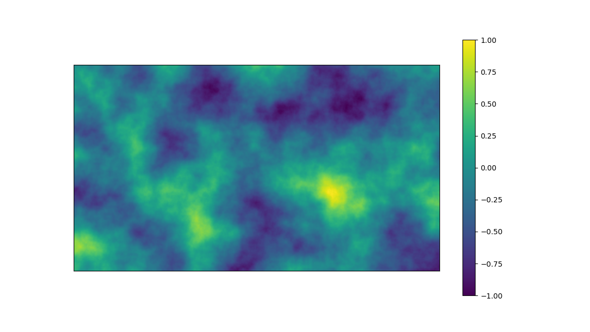

# PerlinNoise
Perlin Noise creation in different languages. Visualise saved txt files with `python python/show_noise.py -n /path/to/noise.txt`. 
More options are available and may be accessed with `python python/show_noise.py -h`. 

## Python
Noise generation with python and numpy. Not optimised in any way. 
Run with `python python/perlin_noise.py -w WIDTH -H height -n NAME.txt -g GRID_SIZE -o OCTAVES -s SEED`.
Necessary packages are `numpy`, `matplotlib`, and `rich`, you can install them with your favourite package manager. 
This code is quite variable and offers a CLI. 

## C++
Noise generation with c++ using standard libraries. Not particularly well written or optimised, slower than the python code. 
Build with `cd cpp` and `make`. Building generates a binary executable `cpp/targets/perlin`. 
Run to generate perlin noise under `data/cpp.txt`. 
To change seed and other generation parameters you need to change the parameters in `cpp/targets/perlin.cpp`. 

## Rust

Noise generation with rust using standard libraries. Not particularly well written or optimised, faster than python code (at least..). 
Build with `cd perlin_rust` and `cargo build` or `cargo run`. 
Generates a binary executable `perlin_rust/target/debug/perlin_rust` which generates perlin noise under `data/rust.txt`. 
Run from folder `perlin_rust` in order to ensure that paths can be found!
Different CLI parameters are available `-w WIDTH`, `-H HEIGHT`, `-g GRID_WIDTH`, `-o OCTAVES`, `-s SEED`, `-n NAME`. Use `-h` for help. 

### Example
